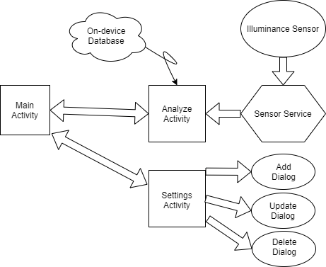

# Illuminance Measurement Tool

### Value Propositon
An Android Application which uses the illumination sensor of the device to evaluate whether the lightning of the environment is ideal or not, in order to:
- Protect the human eye on the long term.
- Save the environment and user funds by lowering electricity consumption, especially on heavily lighted environments.

### Requirements
- An Android mobile device with an Illumination Sensor.
- Database of recommended illumination levels [1] in LUX unit.

The application adds the following functionalities on top of similar products available on Google Play Store:
- Consists of a pre-defined local database with environment types and the healthy illumination intervals for each.
- Allows user to create/remove environments and modify existing parameters.
- Evaluates whether a medium is ideal and if not, issues a warning with sound and haptic feedback.

### Software Architecture

  

### References
[1] https://www.archtoolbox.com/materials-systems/electrical/recommended-lighting-levels-in-buildings.html
